<div align="center">
  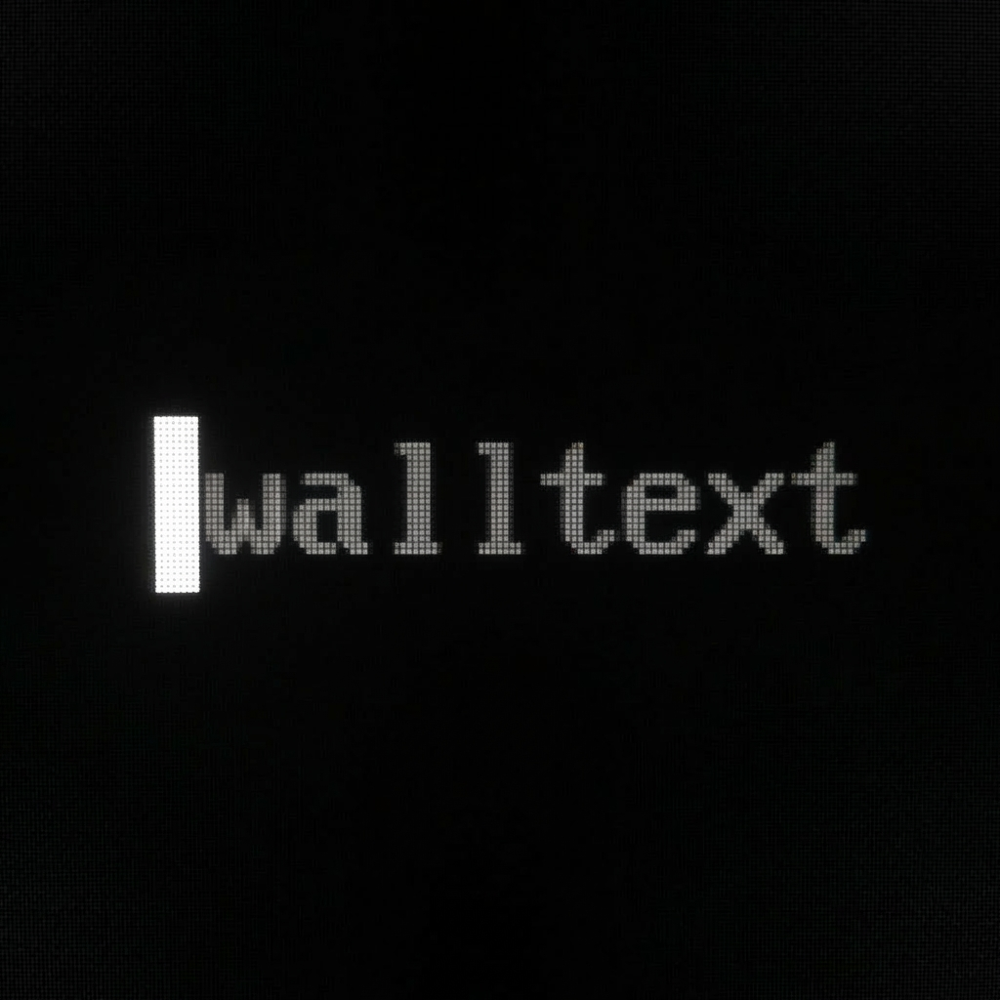
  <h1>Walltext</h1>
  <p><b>Tiny Windows-first CLI for turning text into a screen-sized PNG wallpaper.</b></p>
  <p>
    <a href="https://python.org"></a>
    <a href="LICENSE"></a>
    <a href="https://github.com/Jeetski/walltext"></a>
    <a href="https://hivemindstudio.art"></a>
  </p>
</div>

---

Walltext lets you rapidly generate beautiful desktop wallpapers from plain text or Markdown right from your terminal. It includes rotating background schedules, hot-reloading watchers, and a fully featured Desktop GUI management tool.

Walltext is **free and open-source** under the [MIT License](LICENSE).

## ✨ Features

- **Text & Markdown**: Support for standard text, or robust Markdown with custom frontmatter, built-in themes ([`poster`, `terminal`, `note`]), and BBCode colors (`[color=#ff0000]red[/color]`).
- **Rich Manager GUI**: Easily manage, organize, design, and edit your wallpaper rotation through the native desktop interface.
- **Smart Sizing**: Automatic image sizing pulled directly from your primary display resolution.
- **Watch & Listen**: Re-apply wallpapers dynamically from a changing file (`walltext watch`) or cycle silently through a list on an interval schedule (`walltext listen`).

## 🖼 Gallery

<div align="center">

### Manager GUI
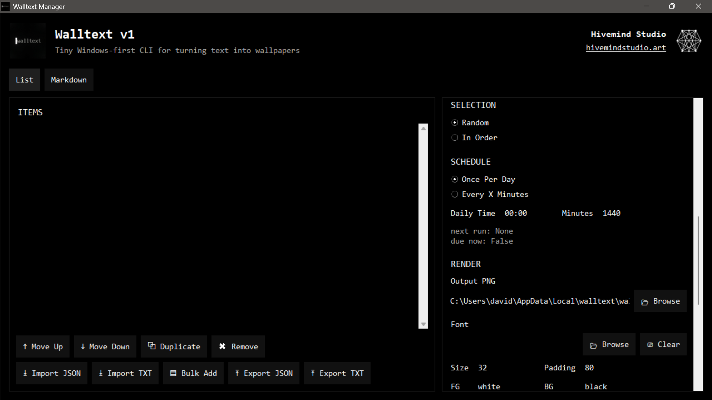
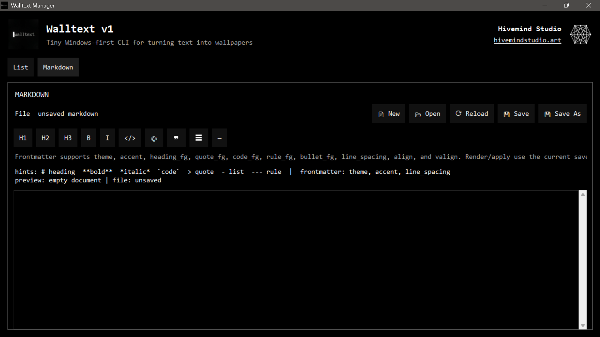

### Wallpaper Use Cases

| Daily Schedule | Seneca Quote |
|:---:|:---:|
| 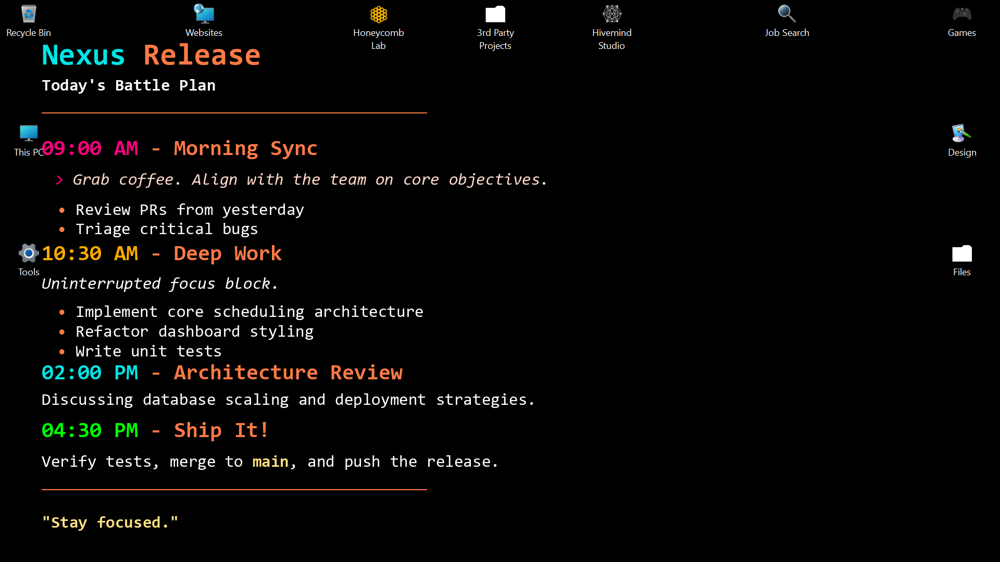 | 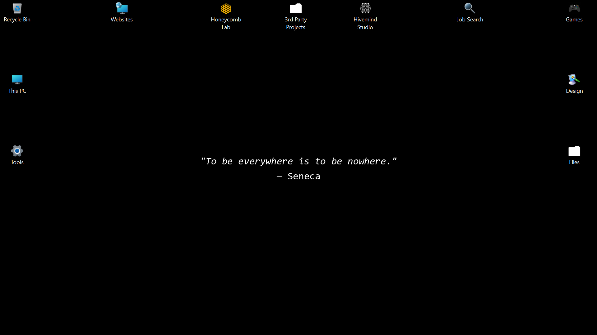 |

| Sprint Board | World Clock |
|:---:|:---:|
| 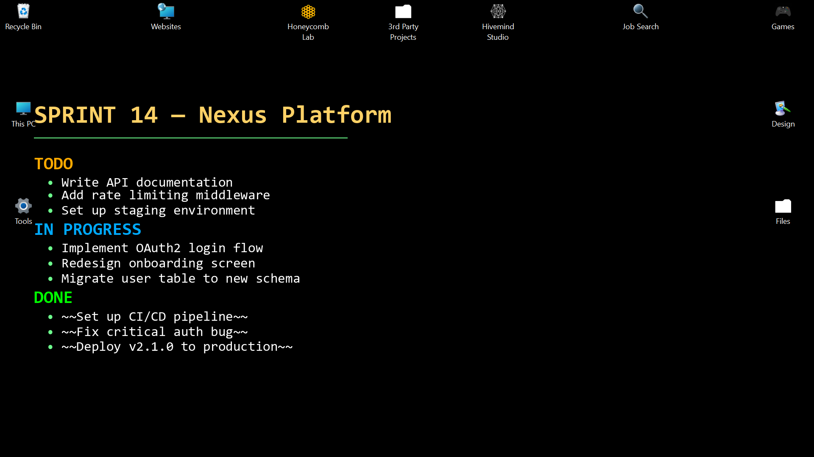 | 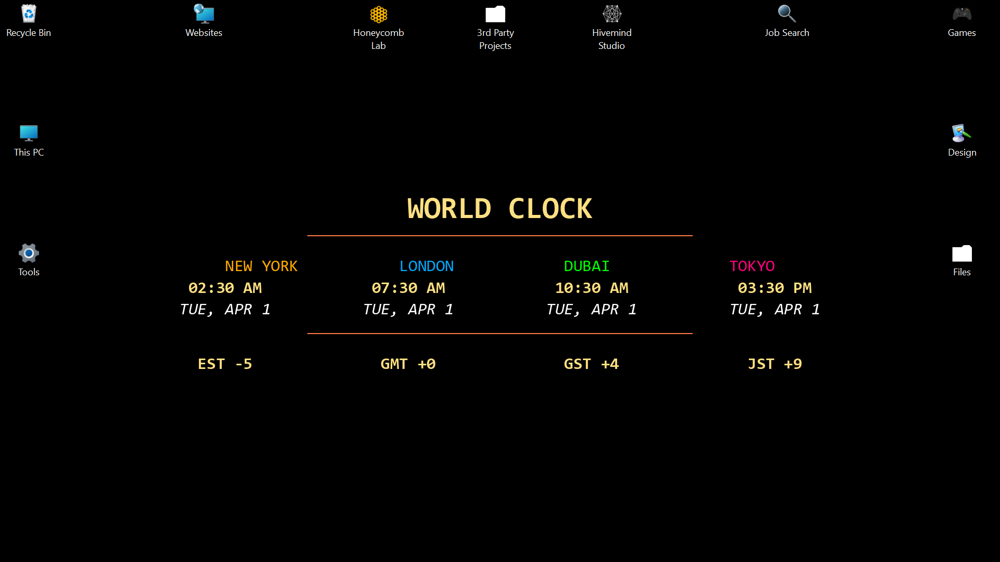 |

| System Metrics | Git Quick Reference |
|:---:|:---:|
| 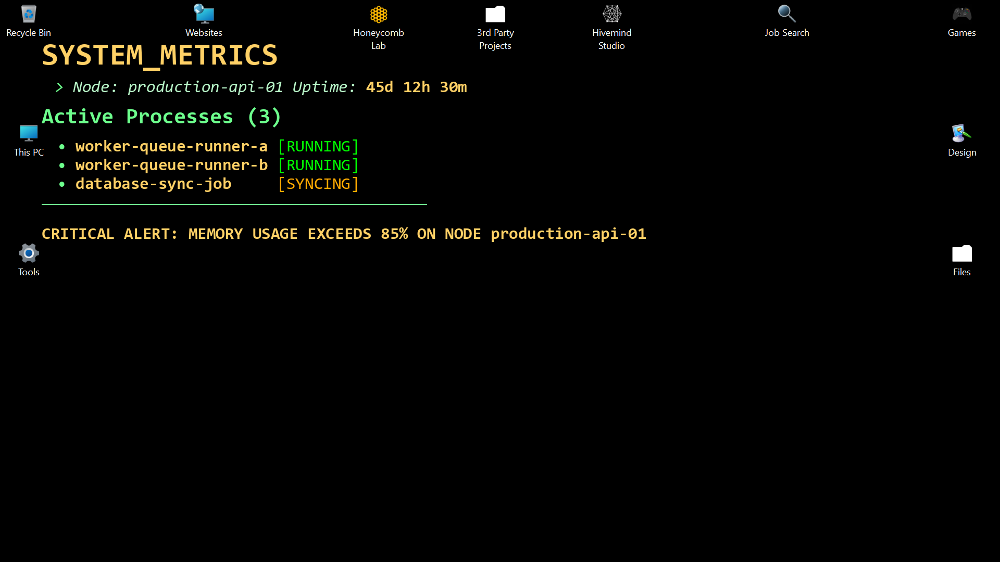 | 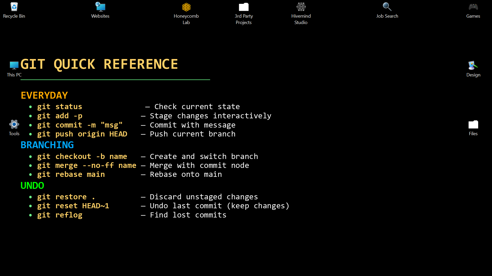 |

| Focus Note | ASCII Art |
|:---:|:---:|
| 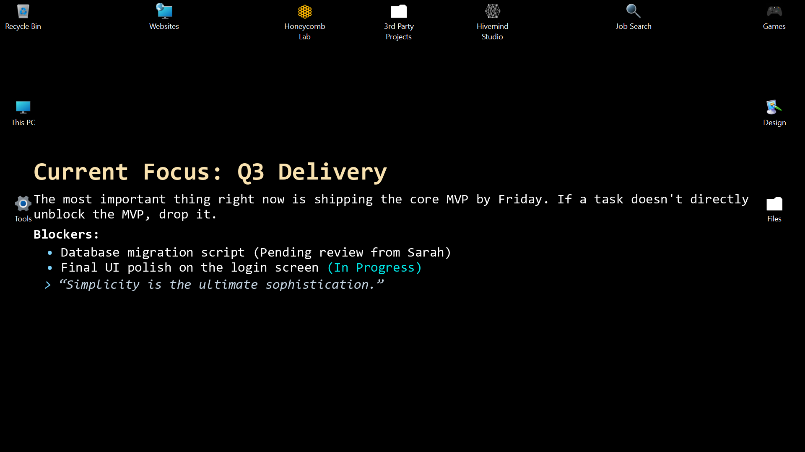 | 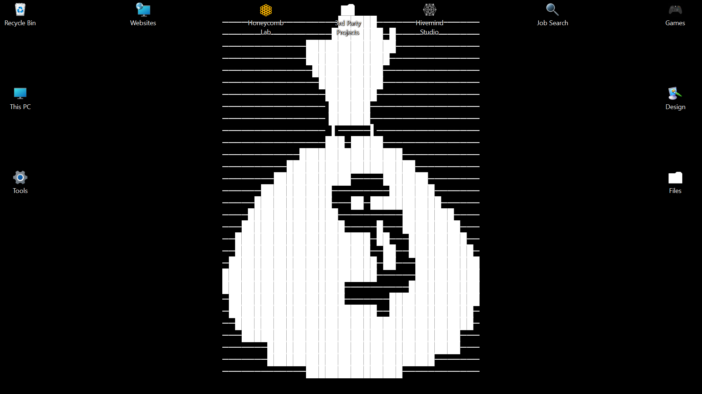 |

</div>

## 🚀 Quick Start

### Installation

Use our interactive Windows installer to gracefully install dependencies, add to your PATH, and build your local workspace:

```powershell
.\install_dependencies.bat
```

_Or if you prefer `pip` directly:_
```powershell
pip install -e .
```

### Try it out!

Generate your first wallpaper simply by running:
```powershell
walltext text "Build complete."
walltext md apply today.md
```

Or open the graphical manager to configure your rotators:
```powershell
walltext manager
```

## 📚 Documentation

| Topic | Description |
|---|---|
| 💻 **[CLI Reference](docs/cli.md)** | Learn how to trigger walltext via terminal commands. |
| 🖼 **[Manager GUI](docs/manager.md)** | Learn how to use the graphical configurations, list, and markdown editors. |
| 📝 **[Markdown Syntax](docs/markdown.md)** | Explore the supported tags, frontmatter theme properties, and styling features. |

## 📄 License

Walltext is released under the [MIT License](LICENSE). Free to use, modify, and distribute.

---

<div align="center">
  <i>Created with 🤍 by </i>
  <a href="https://hivemindstudio.art">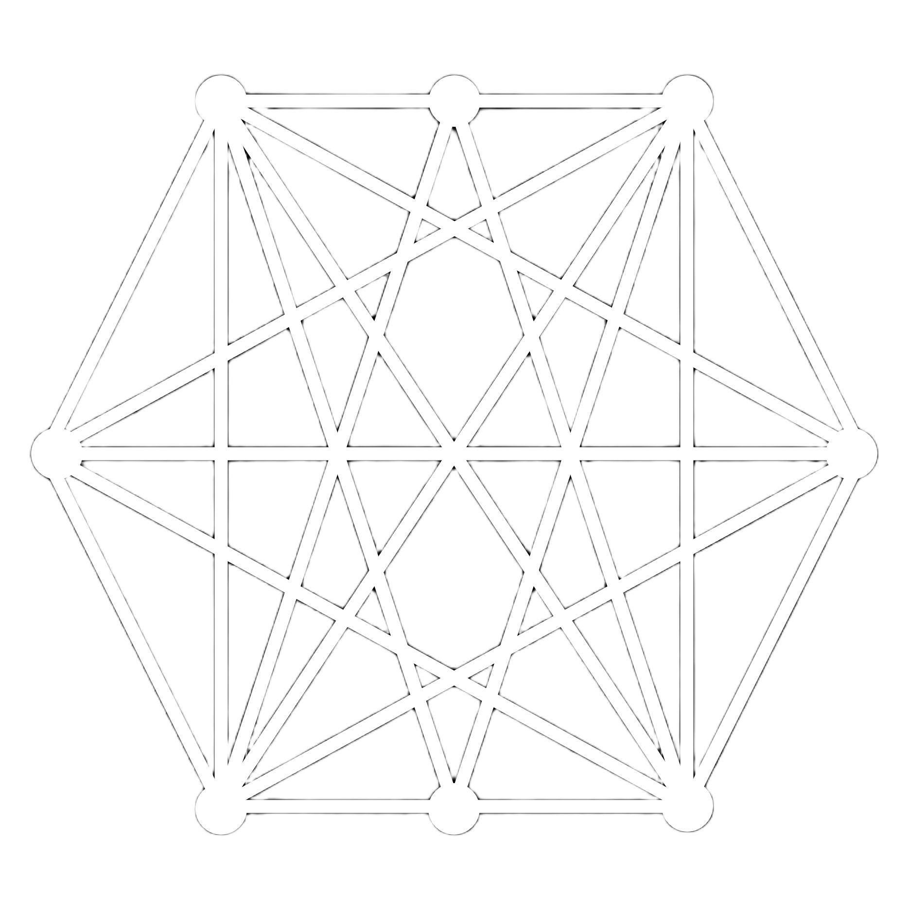 <b>Hivemind Studio</b></a>
</div>
